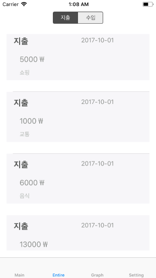
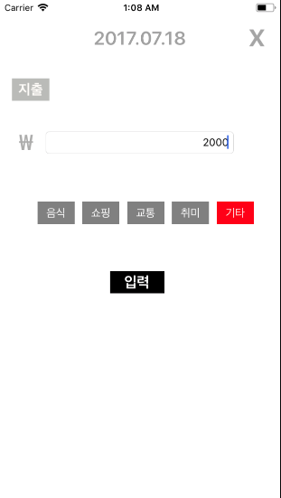
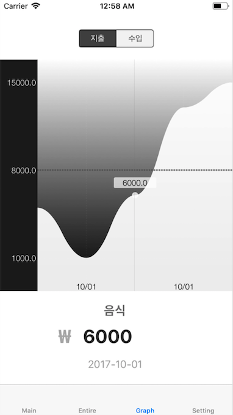

## Money Flow

This is the repository for the iOS_Adv class project in the second semester of 2017.

>Keep Your Money !
>
>Record the flow of your money.

 

## Brief

In short, it's a household app. It will make you manage your money through a simple and convenient UI.

* Record the flow of money day by day through the calendar.
* The graph shows the flow of money at a glance.
* You can see which part of your account is spending the most.

## In app

 

#### This is the splash screen.

 

#### This is the main home screen.

 

#### You can add expenditure at this screen. (also, there is income add view)

 

#### This screen is somewhat unnecessary, but I just put it.

 

#### It shows at a glance through the graph.

## Development

Supported only iOS.

* Xcode
* UI consists of StoryBoard and XIB
* Objective-C
* Realm

## Contributor

@Yongjai